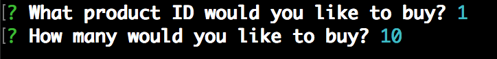

# Node.js_-_MySQL

#### This CLI app uses Node.js and MySQL to create an online shopping experience.

###  **How to use this app:**
- CLone this repo and navigate to the file in the command line
- 'npm install' so all dependecies are loaded
- Use the 'bamazon_db.sql' file to create a MYSQL database
- Run 'node bamazonCustomer.js' in the command line, then follow the prompts.
- Enjoy!

### **How the app functions:**

When the app is started you will be able to see a list of all the avaliable products to purchase in the store.

At the bottom is a prompt asking for the ID number of the product you would like to select. Type the ID number and press ENTER.

Next will be asked how many you would like to buy

Once you enter a quantity the Check Out message will display, showing: 
- The ID you selected
- The quantity you selected
- The total price of your purchase

## The Manager part of the project is not completed but is started and slightly functional....